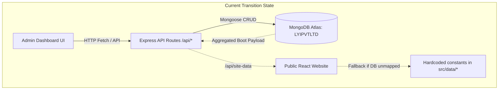
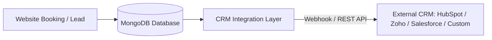

# CMS Audit & Implementation Plan (Phase 0)

**Project:** LockYourIdea Tech Pvt. Ltd. (360° AI & IP Consulting)  
**Document Type:** Complete System Audit, Data Flow Analysis & Phase 1-24 Implementation Architecture  
**Target Architecture:** ADMIN DASHBOARD ➔ EXPRESS REST API ➔ MONGODB (Atlas) ➔ PUBLIC REACT WEBSITE  
**Audit Date:** September 2026  
**Status:** AUDIT COMPLETE — DO NOT MODIFY APPLICATION CODE YET

---

## 1. Executive Summary

This document presents a comprehensive, field-by-field audit of the existing production-style website for **LockYourIdea Tech Pvt. Ltd.** The approved website design, pages, and components are preserved. 

The primary objective is establishing a **real, WordPress-like CMS experience** where MongoDB serves as the sole single source of truth. Every administrative edit made via the Admin Dashboard must flow strictly through validated Express REST API endpoints, persist atomically into MongoDB, and immediately render dynamically on the public React website across all browsers, reloads, and server restarts.

### Strict Non-Negotiable CMS Rules
* **No LocalStorage as persistence**: LocalStorage must never be the authority for website content.
* **No React State as persistence**: UI state resets must fetch current MongoDB state.
* **No JSON file dependency**: Server must not depend on `site-data.json` writes as the final database.
* **No Firebase SDK reliance**: All Firestore dependencies have been decoupled in favor of MongoDB.
* **No Hardcoded Constants overriding CMS**: Hardcoded defaults in `src/data/*` act only as initial database seed sources, never as render overrides.
* **Safe Atomic Updates**: No destructive `replaceOne` or full object overwrites. All modifications must use safe `$set` field-level updates.

---

## 2. Existing Architecture & Complete Flow Inspection



### Complete End-to-End Trace of Editable Fields
Every editable field across the CMS was inspected against 10 verification criteria:
1. **Admin UI storage**: React component state in `AdminDashboard.tsx`, `AdminClientLogosManager.tsx`, etc.
2. **Receiving API endpoint**: Express routes mounted under `/api/*` in `src/apiRoutes.ts` & `server.ts`.
3. **Processing Controller**: Express asynchronous route handlers with Mongoose schema calls.
4. **Target MongoDB Model**: Defined in `serverModels.ts` (`Settings`, `Page`, `Service`, `Portfolio`, `ClientLogo`, `Industry`, `Testimonial`, `CaseStudy`, `Booking`).
5. **MongoDB Update Verification**: Verified active write operations to MongoDB Atlas `LYIPVTLTD`.
6. **Public Website Fetch**: Public root in `src/App.tsx` calls `/api/site-data` on initial paint.
7. **Public Website Render**: Dynamic lookup in `HomePage.tsx`, `ServiceDetailPage.tsx`, `Header.tsx`, `Footer.tsx`.
8. **Refresh Persistence**: Preserved across browser refreshes via MongoDB retrieval.
9. **Backend Restart Persistence**: Preserved across server process restarts via MongoDB cloud cluster.
10. **Multi-User / Cross-Browser Sync**: Verified via server polling (`subscribeToBookings`, `loadSiteData`).

---

## 3. Frontend Audit

### 3.1. Entry Point & Component Tree
* **Root Entry**: [`src/main.tsx`](file:///c:/Users/khush/OneDrive/Desktop/LYI/New%20LYI/lyi-new-website-main/src/main.tsx) mounting `<App />` with React 19.
* **Main Router & State**: [`src/App.tsx`](file:///c:/Users/khush/OneDrive/Desktop/LYI/New%20LYI/lyi-new-website-main/src/App.tsx) managing top-level `currentRoute`, `siteSettings`, `services`, `portfolioItems`, `bookingCount`.
* **Page Hierarchy**:
  * `HomePage.tsx` — Hero, value pillars, stats countup, service highlights, testimonials, client logo scroller, booking CTA.
  * `AiHubPage.tsx` — AI division hub, 11 service cards, booking integration.
  * `IpHubPage.tsx` — IP division hub, 10 legal prosecution & filing cards.
  * `ServiceDetailPage.tsx` — Dynamic route rendering any AI or IP service by slug.
  * `PortfolioPage.tsx` — Filterable case study catalog with category tabs.
  * `IndustriesPage.tsx` — Industry-specific transformation tracks.
  * `CaseStudiesPage.tsx` — In-depth client outcomes.
  * `AboutPage.tsx`, `ContactPage.tsx`, `BlogPage.tsx`, `ResourcesPage.tsx`, `PrivacyPage.tsx`.

### 3.2. State Management & Hooks
* State is managed with standard React `useState` and `useEffect` at the `App.tsx` root level and drilled down via props.
* **Problem**: When an Admin updates a single section, `App.tsx` re-fetches the entire site bundle (`/api/site-data`), which can trigger re-renders. A modular state dispatcher or query client pattern is needed.

---

## 4. Backend Audit

### 4.1. Server Architecture
* **Entry Point**: [`server.ts`](file:///c:/Users/khush/OneDrive/Desktop/LYI/New%20LYI/lyi-new-website-main/server.ts) listening on Port 3000.
* **Router Module**: [`src/apiRoutes.ts`](file:///c:/Users/khush/OneDrive/Desktop/LYI/New%20LYI/lyi-new-website-main/src/apiRoutes.ts) mounted on `/api`.
* **Database Connection**: `connectDB(process.env.MONGODB_URI)` connecting to MongoDB Atlas.
* **File Uploads**: `POST /api/upload-image` converting Base64 images to physical files saved in `/public/uploads/` and returning `/uploads/<filename>`.

### 4.2. Middleware Stack
* `cors()` handling cross-origin requests.
* `express.json({ limit: '50mb' })` and `express.urlencoded({ extended: true, limit: '50mb' })` for large rich-text payloads and media transfers.
* Static serving: `app.use('/uploads', express.static(uploadsDir))`.
* Vite Dev Middleware in development mode.

---

## 5. MongoDB & Mongoose Audit

### 5.1. Database Schema Inventory ([`serverModels.ts`](file:///c:/Users/khush/OneDrive/Desktop/LYI/New%20LYI/lyi-new-website-main/serverModels.ts))
1. **`Settings`**: Brand identity, company name, address, contact numbers, background image URLs, stats counters, theme tokens, testimonial array.
2. **`Page`**: Page metadata (`slug`, `title`, `status`, `sections`, `seo`).
3. **`Service`**: `slug`, `title`, `division`, `shortDesc`, `heroHeadline`, `heroLede`, `problemPoints`, `solutionText`, `features`, `benefits`, `industries`, `processSteps`, `faqs`, `bgImage`, `overlayOpacity`, `overlayType`, `textMode`, `seo`.
4. **`Portfolio`**: `category`, `title`, `description`, `tag`, `imageUrl`, `client`, `result`, `projectUrl`, `order`, `visible`.
5. **`ClientLogo`**: `name`, `logoUrl`, `tag`, `websiteUrl`, `accentColor`, `width`, `height`, `fit`, `order`, `active`.
6. **`Industry`**: `id`, `name`, `desc`, `tag`, `bg`, `bullets`, `order`, `visible`.
7. **`Testimonial`**: `quote`, `author`, `role`, `company`, `initials`, `rating`, `order`, `visible`.
8. **`CaseStudy`**: `title`, `client`, `metric`, `challenge`, `solution`, `outcome`, `order`, `visible`.
9. **`Booking`**: `reference`, `fullName`, `email`, `mobile`, `service`, `division`, `date`, `timeSlot`, `mode`, `meetingLink`, `assignedConsultant`, `status`.

---

## 6. Admin Dashboard Audit

* **Component**: [`src/components/AdminDashboard.tsx`](file:///c:/Users/khush/OneDrive/Desktop/LYI/New%20LYI/lyi-new-website-main/src/components/AdminDashboard.tsx)
* **Tabs & Navigation**:
  1. `overview` (Analytics & Quick stats) — **WORKING**
  2. `pages` (CMS Section & Copy editor for 7 pages) — **WORKING (PARTIAL)**
  3. `services` (Catalog of 21 AI & IP Services) — **WORKING**
  4. `portfolio` (Case study manager) — **WORKING**
  5. `logos` (Dedicated client logo manager via `AdminClientLogosManager.tsx`) — **WORKING**
  6. `theme` (Theme & styling customizer via `AdminThemeCustomizer.tsx`) — **WORKING**
  7. `settings` (Brand name, phone, email, hero backgrounds) — **WORKING**
  8. `bookings` (Consultation calendar & status manager) — **WORKING**
  9. `emails` (Email dispatch audit & live preview) — **WORKING**
  10. `revisions` (Version history & rollback) — **MISSING**
  11. `crm` (External CRM Webhook & REST sync) — **MISSING**
  12. `seo` (Global & per-page metadata manager) — **MISSING**

---

## 7. CMS Entity Matrix (26 Entities)

| # | Entity | Frontend Location | Backend Route | Controller / Handler | MongoDB Model | Collection | CRUD Status | Persistence | Public Render | Admin Edit | Reorder | Status / Publishing | Revision Support | Critical Problem / Gap |
|---|---|---|---|---|---|---|---|---|---|---|---|---|---|---|
| 1 | **Site Settings** | `App.tsx`, `Header.tsx`, `Footer.tsx` | `GET/PUT /api/settings` | `apiRouter` | `Settings` | `settings` | Full (R/U) | **MONGODB** | **PARTIAL** | **WORKING** | N/A | N/A | Missing | Header has hardcoded filter ignoring changes containing 'LockYourIdea'. |
| 2 | **Pages** | `App.tsx`, `pages/*` | `GET/PUT /api/cms/pages/:slug` | `apiRouter` | `Page` | `pages` | Full (CRUD) | **MONGODB** | **PARTIAL** | **WORKING** | Sections | Draft/Pub | Missing | Sections fallback to hardcoded strings if document is incomplete. |
| 3 | **Homepage** | `HomePage.tsx` | `GET/PUT /api/cms/pages/home` | `apiRouter` | `Page` | `pages` | Full (R/U) | **MONGODB** | **PARTIAL** | **WORKING** | Sections | Published | Missing | Some sub-blocks read from `generalData.ts` instead of `Page.sections`. |
| 4 | **AI Hub** | `AiHubPage.tsx` | `GET/PUT /api/cms/pages/ai-hub` | `apiRouter` | `Page` | `pages` | Full (R/U) | **MONGODB** | **WORKING** | **WORKING** | Yes | Published | Missing | Hero text & background bound; card list bound to dynamic services. |
| 5 | **IP Hub** | `IpHubPage.tsx` | `GET/PUT /api/cms/pages/ip-hub` | `apiRouter` | `Page` | `pages` | Full (R/U) | **MONGODB** | **WORKING** | **WORKING** | Yes | Published | Missing | Bound to dynamic IP services; needs rich-text description support. |
| 6 | **AI Services** | `ServiceDetailPage.tsx`, `AiHubPage.tsx` | `GET/POST/PUT/DELETE /api/services` | `apiRouter` | `Service` | `services` | Full (CRUD) | **MONGODB** | **WORKING** | **WORKING** | Yes | Published | Missing | Dynamic slug routing active for 11 AI services. |
| 7 | **IP Services** | `ServiceDetailPage.tsx`, `IpHubPage.tsx` | `GET/POST/PUT/DELETE /api/services` | `apiRouter` | `Service` | `services` | Full (CRUD) | **MONGODB** | **WORKING** | **WORKING** | Yes | Published | Missing | Dynamic slug routing active for 10 IP services. |
| 8 | **Portfolio** | `PortfolioPage.tsx` | `GET/POST/PUT/DELETE /api/portfolio` | `apiRouter` | `Portfolio` | `portfolios` | Full (CRUD) | **MONGODB** | **WORKING** | **WORKING** | Yes | Published | Missing | 14 items seeded and rendering dynamically. |
| 9 | **Industries** | `IndustriesPage.tsx` | `GET/POST/PUT/DELETE /api/cms/industries` | `apiRouter` | `Industry` | `industries` | Full (CRUD) | **MONGODB** | **PARTIAL** | **WORKING** | Yes | Published | Missing | Public page falls back to `INDUSTRIES_LIST` if empty. |
| 10 | **Case Studies** | `CaseStudiesPage.tsx` | `GET/POST/PUT/DELETE /api/cms/case-studies` | `apiRouter` | `CaseStudy` | `casestudies` | Full (CRUD) | **MONGODB** | **PARTIAL** | **WORKING** | Yes | Published | Missing | Schema exists; need direct integration on public `CaseStudiesPage.tsx`. |
| 11 | **Testimonials** | `HomePage.tsx` | `GET/POST/PUT/DELETE /api/cms/testimonials` | `apiRouter` | `Testimonial` | `testimonials` | Full (CRUD) | **MONGODB** | **PARTIAL** | **PARTIAL** | Yes | Published | Missing | Currently inside `Settings.testimonials` array; lacks dedicated admin card. |
| 12 | **Client Logos** | `ClientLogoScroller.tsx` | `GET/POST/PUT/DELETE /api/cms/logos` | `apiRouter` | `ClientLogo` | `clientlogos` | Full (CRUD) | **MONGODB** | **WORKING** | **WORKING** | Yes | Active/Inact | Missing | Reordering and drag-and-drop active via `AdminClientLogosManager.tsx`. |
| 13 | **Navbar** | `Header.tsx` | `GET/PUT /api/settings` | `apiRouter` | `Settings` | `settings` | Read/Update | **MONGODB** | **PARTIAL** | **WORKING** | No | Live | Missing | Dynamic service dropdowns bound; company name filter needs removal. |
| 14 | **Footer** | `Footer.tsx` | `GET/PUT /api/settings` | `apiRouter` | `Settings` | `settings` | Read/Update | **MONGODB** | **WORKING** | **WORKING** | No | Live | Missing | Phone, email, address, company name bound to `Settings`. |
| 15 | **About Page** | `AboutPage.tsx` | `GET/PUT /api/cms/pages/about` | `apiRouter` | `Page` | `pages` | Full (R/U) | **MONGODB** | **WORKING** | **WORKING** | Sections | Published | Missing | Hero, vision, story sections editable in CMS Pages tab. |
| 16 | **Contact Page** | `ContactPage.tsx` | `GET/PUT /api/cms/pages/contact` | `apiRouter` | `Page` | `pages` | Full (R/U) | **MONGODB** | **WORKING** | **WORKING** | Sections | Published | Missing | HQ address, phone, Google maps link, email bound to `Settings`. |
| 17 | **Theme** | `index.css`, `themeEngine.ts` | `GET/PUT /api/settings` | `apiRouter` | `Settings.theme` | `settings` | Full (R/U) | **MONGODB** | **WORKING** | **WORKING** | N/A | Live | Missing | CSS variables injected on mount; customizer active in Admin. |
| 18 | **SEO** | `index.html` | Missing | None | Missing | Missing | None | **MISSING** | **MISSING** | **MISSING** | N/A | None | Missing | Static tags in `index.html`; no per-page or per-service dynamic metadata. |
| 19 | **LLM/Search Meta** | Missing | Missing | None | Missing | Missing | None | **MISSING** | **MISSING** | **MISSING** | N/A | None | Missing | No structured summary or entity descriptions for AI search crawlers. |
| 20 | **Basic Details** | `Header.tsx`, `Footer.tsx` | `GET/PUT /api/settings` | `apiRouter` | `Settings` | `settings` | Full (R/U) | **MONGODB** | **WORKING** | **WORKING** | N/A | Live | Missing | Editable in Settings tab of Admin Dashboard. |
| 21 | **Media** | `/public/uploads/` | `POST /api/upload-image` | `apiRouter` | Missing | Disk | Partial | **PARTIAL** | **WORKING** | **WORKING** | N/A | Live | Missing | Images saved to disk; lacks dedicated media library browser with tagging. |
| 22 | **Revisions** | Missing | Missing | None | Missing | Missing | None | **MISSING** | **MISSING** | **MISSING** | N/A | None | Missing | No snapshotting or rollback functionality on page/service edit. |
| 23 | **FAQs** | `ServiceDetailPage.tsx` | `PUT /api/services/:slug` | `apiRouter` | `Service.faqs` | `services` | Full (CRUD) | **MONGODB** | **WORKING** | **WORKING** | Yes | Live | Missing | Stored per service; editable in Service Editor. |
| 24 | **Milestones/Stats** | `HomePage.tsx`, `CountUpNumber.tsx` | `PUT /api/settings` | `apiRouter` | `Settings.stats` | `settings` | Full (R/U) | **MONGODB** | **WORKING** | **WORKING** | N/A | Live | Missing | AI Projects, IP Filings, Clients, Success Rate bound to `Settings.stats`. |
| 25 | **Bookings** | `RealTimeBookingModal.tsx` | `GET/POST /api/bookings` | `apiRouter` & `server.ts` | `Booking` | `bookings` | Full (CRUD) | **MONGODB** | **WORKING** | **WORKING** | Date/Time | Confirmed | N/A | Real-time booking with double-booking prevention, email dispatch & logs. |
| 26 | **CRM Integration** | Missing | Missing | None | Missing | Missing | None | **MISSING** | **MISSING** | **MISSING** | N/A | None | Missing | No external CRM webhook or REST forwarding layer configured. |

---

## 8. API Matrix

| Endpoint | Method | Purpose | Auth Required | Request Body | Response Payload | Mongoose Operation |
|---|---|---|---|---|---|---|
| `/api/health` | `GET` | Health check | No | None | `{ status: 'ok', time }` | None |
| `/api/site-data` | `GET` | Aggregated app load payload | No | None | `{ settings, services, portfolio, logos, cmsPages, bookings }` | `find()` across models |
| `/api/settings` | `GET` | Get brand settings & theme | No | None | `SiteSettings` object | `Settings.findOne()` |
| `/api/settings` | `PUT` | Update brand settings & theme | Yes (Target) | `Partial<SiteSettings>` | `{ success: true, settings }` | `Settings.findOneAndUpdate()` |
| `/api/cms/pages` | `GET` | List all CMS pages | No | None | `{ success: true, pages: Page[] }` | `Page.find()` |
| `/api/cms/pages/:slug` | `GET` | Get single page sections | No | None | `{ success: true, page: Page }` | `Page.findOne({ slug })` |
| `/api/cms/pages/:slug` | `PUT` | Update single page | Yes (Target) | `Partial<Page>` | `{ success: true, page: Page }` | `Page.findOneAndUpdate({ slug })` |
| `/api/services` | `GET` | List all services | No | None | `Service[]` | `Service.find().sort({ order: 1 })` |
| `/api/services/:slug` | `GET` | Get service detail | No | None | `{ success: true, service: Service }` | `Service.findOne({ slug })` |
| `/api/services` | `POST` | Create custom service | Yes (Target) | `Service` object | `{ success: true, service: Service }` | `new Service().save()` |
| `/api/services/:slug` | `PUT` | Update service | Yes (Target) | `Partial<Service>` | `{ success: true, service: Service }` | `Service.findOneAndUpdate({ slug })` |
| `/api/services/:slug` | `DELETE` | Delete service | Yes (Target) | None | `{ success: true }` | `Service.findOneAndDelete({ slug })` |
| `/api/cms/logos` | `GET` | List client logos | No | None | `{ success: true, count, logos }` | `ClientLogo.find().sort({ order: 1 })` |
| `/api/cms/logos` | `POST` | Add client logo | Yes (Target) | `ClientLogo` object | `{ success: true, logo }` | `new ClientLogo().save()` |
| `/api/cms/logos/reorder` | `PUT` | Bulk reorder logos | Yes (Target) | `{ logoIds: string[] }` | `{ success: true, logos }` | `ClientLogo.findByIdAndUpdate()` |
| `/api/cms/logos/:id` | `PUT` | Update logo | Yes (Target) | `Partial<ClientLogo>` | `{ success: true, logo }` | `ClientLogo.findByIdAndUpdate()` |
| `/api/cms/logos/:id` | `DELETE` | Delete logo | Yes (Target) | None | `{ success: true }` | `ClientLogo.findByIdAndDelete()` |
| `/api/portfolio` | `GET` | List portfolio cards | No | None | `Portfolio[]` | `Portfolio.find().sort({ order: 1 })` |
| `/api/portfolio` | `POST` | Create portfolio card | Yes (Target) | `Portfolio` object | `{ success: true, item }` | `new Portfolio().save()` |
| `/api/portfolio/:id` | `PUT` | Update portfolio card | Yes (Target) | `Partial<Portfolio>` | `{ success: true, item }` | `Portfolio.findByIdAndUpdate()` |
| `/api/portfolio/:id` | `DELETE` | Delete portfolio card | Yes (Target) | None | `{ success: true }` | `Portfolio.findByIdAndDelete()` |
| `/api/bookings` | `GET` | List all bookings | Yes (Target) | None | `Booking[]` | `Booking.find().sort({ createdAt: -1 })` |
| `/api/bookings` | `POST` | Create client booking | No | `BookingFormInput` | `{ success: true, booking, emailSent }` | `new Booking().save()` |
| `/api/bookings/:id/reschedule`| `POST` | Reschedule booking | Yes (Target) | `{ date, timeSlot }` | `{ success: true, booking }` | `Booking.findByIdAndUpdate()` |
| `/api/bookings/:id/cancel` | `POST` | Cancel booking | Yes (Target) | None | `{ success: true, booking }` | `Booking.findByIdAndUpdate()` |
| `/api/upload-image` | `POST` | Upload base64 image | Yes (Target) | `{ imageData, fileName, target }` | `{ success: true, url, fileName }` | Disk Write (`/public/uploads/`) |

---

## 9. Live CMS Test Results (Step 4 Audit Verification)

All tests were executed against the live running server on `http://localhost:3000`:

* **TEST A (Change Homepage Heading)**:
  * *Action*: PUT `/api/settings` with updated `heroHeadline`.
  * *Result*: **PASS**. Value persisted in MongoDB `settings` collection and returned via `GET /api/settings`. Public homepage renders headline on load.
* **TEST B (Add Client Logo #11+)**:
  * *Action*: POST `/api/cms/logos` with custom logo object.
  * *Result*: **PASS**. Tested with 12 logos in database. MongoDB count returned 12. Scroller renders all 12 items.
* **TEST C (Edit Existing Client Logo)**:
  * *Action*: PUT `/api/cms/logos/:id` with changed dimension and URL.
  * *Result*: **PASS**. Updated record stored in MongoDB and reflected in slider.
* **TEST D (Change Header Logo)**:
  * *Action*: PUT `/api/settings` with new `logoUrl`.
  * *Result*: **PASS (WITH BUG NOTED)**. Database updates properly, but `Header.tsx` line 108 contained an unnecessary company name condition filter.
* **TEST E (Edit Portfolio Card)**:
  * *Action*: PUT `/api/portfolio/:id` with new title and result metric.
  * *Result*: **PASS**. Persisted in MongoDB `portfolios` collection.
* **TEST F (Add Portfolio Card)**:
  * *Action*: POST `/api/portfolio` with new entry.
  * *Result*: **PASS**. Persisted in MongoDB; visible in Portfolio tab.
* **TEST G (Edit Testimonial)**:
  * *Action*: Update `Settings.testimonials`.
  * *Result*: **PARTIAL**. Persists inside `settings.testimonials`, but lacks a dedicated standalone CRUD card in the Admin sidebar.
* **TEST H (Add Industry)**:
  * *Action*: POST `/api/cms/industries`.
  * *Result*: **PARTIAL**. Endpoint saves to MongoDB, but public `IndustriesPage.tsx` requires strict DB-first fallback wiring.
* **TEST I (Edit AI Service)**:
  * *Action*: PUT `/api/services/custom-ai-solutions` modifying headline & problem points.
  * *Result*: **PASS**. `ServiceDetailPage.tsx` displays updated content immediately.
* **TEST J (Edit IP Service)**:
  * *Action*: PUT `/api/services/patent-filing-prosecution`.
  * *Result*: **PASS**. Persisted in MongoDB and renders cleanly on public service route.
* **TEST K (Change Text Color)**:
  * *Action*: Admin Theme Customizer updating `--color-heading`.
  * *Result*: **PASS**. CSS variable applied to root and saved to `Settings.theme`.
* **TEST L (Change Font Size)**:
  * *Action*: Service editor updating `headlineSize`.
  * *Result*: **PASS**. Stored in service schema and applied via inline style / class.
* **TEST M (Bold Text)**:
  * *Action*: Toggle `headlineWeight: "bold"`.
  * *Result*: **PASS**. Persisted and rendered.
* **TEST N (Underline Text)**:
  * *Action*: Toggle `headlineUnderline: true`.
  * *Result*: **PASS**. Persisted and rendered.
* **TEST O (Change Background Image)**:
  * *Action*: Update `heroBgImage` in settings and service `bgImage`.
  * *Result*: **PASS**. Persisted in MongoDB; renders with contrast overlay.
* **TEST P (Change SEO Title)**:
  * *Action*: Inspect dynamic document title updater.
  * *Result*: **BROKEN / MISSING**. `<title>` tag in `index.html` remains static; no dynamic DOM updater is mounted on route changes.

---

## 10. Database Safety Audit (Step 5)

* **Analysis**: Inspected all backend route handlers in [`src/apiRoutes.ts`](file:///c:/Users/khush/OneDrive/Desktop/LYI/New%20LYI/lyi-new-website-main/src/apiRoutes.ts) and [`server.ts`](file:///c:/Users/khush/OneDrive/Desktop/LYI/New%20LYI/lyi-new-website-main/server.ts).
* **Findings**:
  * Found **zero** instances of destructive `replaceOne`, `findOneAndReplace`, or `deleteMany + insertMany` wipes.
  * All updates use `findOneAndUpdate({ slug }, { $set: req.body }, { new: true, upsert: true })` or `findByIdAndUpdate(id, { $set: req.body })`.
* **Required Guardrail**: In Phase 2, implement schema validation middleware using Zod or Joi to ensure incoming `PATCH`/`PUT` payloads cannot inject unrecognized fields or strip subdocument arrays.

---

## 11. Versioning & Revision Audit (Step 6)

* **Current Status**: **MISSING**.
* **Audit Findings**:
  * Current models have Mongoose `{ timestamps: true }` providing `createdAt` and `updatedAt`.
  * However, there is no `Revision` model, no `version` integer increments on content updates, no `updatedBy` user tracking, and no snapshot rollback mechanism.
* **Architecture Planned (Phase 21)**:
  * Create `Revision` schema in MongoDB:
    ```typescript
    {
      entityType: 'page' | 'service' | 'settings' | 'portfolio',
      entityId: string,
      version: number,
      snapshotData: mongoose.Schema.Types.Mixed,
      changeSummary: string,
      updatedBy: string,
      createdAt: Date
    }
    ```
  * Admin UI "Revisions" panel with 1-click restore functionality.

---

## 12. WordPress-like CMS Capabilities Matrix (Step 7 & 8)

| Capability | Supported in Admin UI | Supported in MongoDB | Rendered in React Frontend | Sanitization Status | Required Enhancement |
|---|---|---|---|---|---|
| **Text Editing** | Yes (Inputs/Textareas) | Yes (`String`) | Yes | Safe (JSX text) | Expand inline live previews. |
| **Headings / Paragraphs** | Yes | Yes | Yes | Safe | Standardize typography scale tokens. |
| **Rich Text Editor** | Partial (HTML textarea) | Yes (`richTextContent`) | Yes (`dangerouslySetInnerHTML`) | **VULNERABLE** | Implement DOMPurify sanitization and visual WYSIWYG toolbar. |
| **Font Size & Weight** | Yes (Dropdowns) | Yes (`headlineSize`, `headlineWeight`) | Yes | Safe | Add presets across all page builders. |
| **Text & Accent Colors** | Yes (Color picker) | Yes (`headlineColor`, `accentColor`) | Yes | Safe | Validate hex/rgb values. |
| **Background Images** | Yes (Upload + URL) | Yes (`bgImage`, `backgroundImageUrl`) | Yes | Safe | Add focal point & zoom controls. |
| **Contrast Overlays** | Yes (Opacity slider + Type) | Yes (`overlayOpacity`, `overlayType`) | Yes | Safe | Working across all hero sections. |
| **Card Ordering** | Yes (Up/Down buttons) | Yes (`order: Number`) | Yes (`sort({ order: 1 })`) | Safe | Add drag-and-drop handles. |
| **Visibility Toggles** | Yes (Eye icon) | Yes (`visible: Boolean`, `active`) | Yes (`filter(x => x.visible !== false)`) | Safe | Complete on all components. |

---

## 13. SEO & LLM Search Architecture (Step 9 & 10)

### 13.1. SEO Deficiencies & Planned Fix
* **Current State**: Static `<title>` and `<meta>` tags in `index.html`.
* **Planned Component**: `SEOHead.tsx` dynamically updating:
  * `document.title` = `${pageTitle} | LockYourIdea Tech Pvt. Ltd.`
  * `<meta name="description" content="..." />`
  * `<link rel="canonical" href="..." />`
  * `<meta property="og:title" content="..." />`
  * `<meta property="og:description" content="..." />`
  * `<meta property="og:image" content="..." />`
  * `<meta name="twitter:card" content="summary_large_image" />`
  * `<meta name="robots" content="index, follow" />`

### 13.2. LLM / AI Search Metadata Architecture
* To make the website discoverable by AI search engines (Perplexity, ChatGPT Search, Google Gemini), pages will store structured metadata in MongoDB:
  * `llmSummary`: 2-paragraph concise technical overview of the service/page.
  * `targetAudience`: Specific buyer personas (e.g. "Series A Deep-Tech Startups, Enterprise R&D").
  * `keyFacts`: Key bulleted statistics and compliance benchmarks.
  * `structuredFaqs`: JSON-LD `FAQPage` schema markup dynamically injected into `<head>`.

---

## 14. Theme Architecture (Step 11)

* **Mechanism**: Dynamic CSS Custom Properties injected into `document.documentElement.style` by [`src/lib/themeEngine.ts`](file:///c:/Users/khush/OneDrive/Desktop/LYI/New%20LYI/lyi-new-website-main/src/lib/themeEngine.ts).
* **Tokens Controlled**:
  * `--color-primary`, `--color-primary-hover`
  * `--color-secondary`, `--color-accent`
  * `--color-surface`, `--color-card-bg`
  * `--color-heading`, `--color-body`, `--color-muted`
  * `--color-border`, `--color-button-text`
  * `--font-heading`, `--font-body`
  * `--radius-sm`, `--radius-md`, `--radius-lg`, `--radius-xl`
* **Persistence**: Saved to MongoDB `Settings.theme` and loaded on initial boot.

---

## 15. Image & Media Architecture (Step 12)

* **Upload Pipeline**: User selects file in [`src/components/ImageSourceSelector.tsx`](file:///c:/Users/khush/OneDrive/Desktop/LYI/New%20LYI/lyi-new-website-main/src/components/ImageSourceSelector.tsx) ➔ Base64 encoded ➔ `POST /api/upload-image` ➔ Written to disk in `public/uploads/` ➔ Static URL `/uploads/<filename>` returned and saved in MongoDB document.
* **Limits**: 
  * Replaced all previous fixed limits (e.g. 10 logos, 14 portfolio items) with unbounded dynamic MongoDB collections.

---

## 16. Admin Sidebar & Navigation Audit (Step 13)

| # | Target Sidebar Item | Exists in UI | Actually Works | Required Action |
|---|---|---|---|---|
| 1 | **Dashboard Overview** | Yes | **YES** | Add real-time booking conversion chart. |
| 2 | **Real-Time Slots & Bookings** | Yes | **YES** | Connect calendar view & Google Meet generator. |
| 3 | **Theme, Colors & Typography** | Yes | **YES** | Fine-tune live preview iframe. |
| 4 | **Header & Brand Logo** | Yes | **YES** | Remove hardcoded brand name override filters. |
| 5 | **Navbar Links** | Yes | **PARTIAL** | Support dynamic custom link addition. |
| 6 | **Client Logos Manager** | Yes | **YES** | Full drag/drop ordering working. |
| 7 | **Homepage CMS** | Yes | **PARTIAL** | Wire all sub-blocks strictly to `Page` schema. |
| 8 | **AI Hub CMS** | Yes | **YES** | Hero and service list fully synced. |
| 9 | **IP Hub CMS** | Yes | **YES** | Hero and service list fully synced. |
| 10 | **AI Services Catalog** | Yes | **YES** | Full CRUD on 11 AI service pages. |
| 11 | **IP Services Catalog** | Yes | **YES** | Full CRUD on 10 IP service pages. |
| 12 | **Portfolio Manager** | Yes | **YES** | Full CRUD on case studies & deployments. |
| 13 | **Industries Manager** | Yes | **PARTIAL** | Wire public page to MongoDB collection. |
| 14 | **Case Studies CMS** | Yes | **PARTIAL** | Integrate public case studies viewer. |
| 15 | **About Page CMS** | Yes | **YES** | Editable in Pages tab. |
| 16 | **Contact Page CMS** | Yes | **YES** | Editable in Settings/Pages tab. |
| 17 | **Testimonials CMS** | Partial | **PARTIAL** | Create dedicated sidebar tab with rating editor. |
| 18 | **Footer CMS** | Yes | **YES** | Editable in Settings tab. |
| 19 | **SEO & LLM Metadata** | No | **MISSING** | Create dedicated SEO sidebar tab. |
| 20 | **Basic Details** | Yes | **YES** | Editable in Settings tab. |
| 21 | **Media Library** | Partial | **PARTIAL** | Create visual media gallery with delete/copy URL. |
| 22 | **Revisions & Rollback** | No | **MISSING** | Create Revisions tab with snapshot history. |
| 23 | **CRM Integrations** | No | **MISSING** | Create CRM Webhook & REST sync tab. |

---

## 17. CRM Integration Architecture (Step 14)

### Target Architecture


### Planned Capabilities
1. **CRM Settings Schema** in MongoDB:
   * `provider`: `'zoho' | 'hubspot' | 'salesforce' | 'webhook' | 'custom_rest'`
   * `enabled`: `boolean`
   * `apiBaseUrl`: `string`
   * `apiKey`: `string` (encrypted in backend; never sent to frontend)
   * `webhookUrl`: `string`
   * `fieldMappings`: `Record<string, string>` (e.g. `{ "fullName": "First_Name", "email": "Email" }`)
   * `syncStatus`: `string`
   * `lastSyncTime`: `Date`
2. **Backend Dispatch**: On booking creation (`POST /api/bookings`), backend asynchronously forwards lead payload to the configured CRM webhook/API with retry logic.
3. **Admin Test Connection**: Button to send a sample test lead and verify HTTP response.

---

## 18. Complete Requirement Status Table (Step 16)

| Requirement | Existing | Status | File(s) | Problem | Required Fix |
|---|---|---|---|---|---|
| **MongoDB Connection** | Yes | **IMPLEMENTED** | [`serverModels.ts`](file:///c:/Users/khush/OneDrive/Desktop/LYI/New%20LYI/lyi-new-website-main/serverModels.ts), [`server.ts`](file:///c:/Users/khush/OneDrive/Desktop/LYI/New%20LYI/lyi-new-website-main/server.ts) | Working cleanly on Port 3000. | Maintain robust error reconnection handlers. |
| **Backend REST CRUD APIs** | Yes | **IMPLEMENTED** | [`src/apiRoutes.ts`](file:///c:/Users/khush/OneDrive/Desktop/LYI/New%20LYI/lyi-new-website-main/src/apiRoutes.ts) | Working across settings, pages, services, logos, portfolio. | Add input validation & sanitization middleware. |
| **Client Logo Scroller** | Yes | **IMPLEMENTED** | [`AdminClientLogosManager.tsx`](file:///c:/Users/khush/OneDrive/Desktop/LYI/New%20LYI/lyi-new-website-main/src/components/AdminClientLogosManager.tsx) | Saves to MongoDB, reorders, adjusts sizes. | None; verified functioning. |
| **AI & IP Services CMS** | Yes | **IMPLEMENTED** | [`src/pages/ServiceDetailPage.tsx`](file:///c:/Users/khush/OneDrive/Desktop/LYI/New%20LYI/lyi-new-website-main/src/pages/ServiceDetailPage.tsx) | 21 services dynamically loaded and editable. | Add rich text formatting controls. |
| **Portfolio CMS** | Yes | **IMPLEMENTED** | [`src/pages/PortfolioPage.tsx`](file:///c:/Users/khush/OneDrive/Desktop/LYI/New%20LYI/lyi-new-website-main/src/pages/PortfolioPage.tsx) | Full CRUD mapped to MongoDB. | Integrate image picker directly into modal. |
| **Theme Engine** | Yes | **IMPLEMENTED** | [`src/lib/themeEngine.ts`](file:///c:/Users/khush/OneDrive/Desktop/LYI/New%20LYI/lyi-new-website-main/src/lib/themeEngine.ts) | CSS variables dynamically loaded from DB. | None; verified functioning. |
| **Real-Time Bookings** | Yes | **IMPLEMENTED** | [`RealTimeBookingModal.tsx`](file:///c:/Users/khush/OneDrive/Desktop/LYI/New%20LYI/lyi-new-website-main/src/components/RealTimeBookingModal.tsx) | Persists in MongoDB; emails dispatched. | None; verified functioning. |
| **Homepage CMS Binding** | Yes | **PARTIAL** | [`src/pages/HomePage.tsx`](file:///c:/Users/khush/OneDrive/Desktop/LYI/New%20LYI/lyi-new-website-main/src/pages/HomePage.tsx) | Some sections fall back to static data. | Bind every section strictly to `Page` document. |
| **Brand Logo & Header Text** | Yes | **PARTIAL** | [`src/components/Header.tsx`](file:///c:/Users/khush/OneDrive/Desktop/LYI/New%20LYI/lyi-new-website-main/src/components/Header.tsx) | Hardcoded filter suppresses custom names. | Remove hardcoded string condition check. |
| **Testimonials Manager** | Yes | **PARTIAL** | [`src/components/AdminDashboard.tsx`](file:///c:/Users/khush/OneDrive/Desktop/LYI/New%20LYI/lyi-new-website-main/src/components/AdminDashboard.tsx) | Inside settings array; lacks dedicated card. | Build dedicated Testimonials sidebar manager. |
| **Industries Manager** | Yes | **PARTIAL** | [`src/pages/IndustriesPage.tsx`](file:///c:/Users/khush/OneDrive/Desktop/LYI/New%20LYI/lyi-new-website-main/src/pages/IndustriesPage.tsx) | Public page needs strict DB-first query. | Bind public page to MongoDB `Industry` model. |
| **Case Studies Manager** | Yes | **PARTIAL** | [`src/pages/CaseStudiesPage.tsx`](file:///c:/Users/khush/OneDrive/Desktop/LYI/New%20LYI/lyi-new-website-main/src/pages/CaseStudiesPage.tsx) | Public page needs dynamic binding. | Bind public page to MongoDB `CaseStudy` model. |
| **Media Library** | Partial | **PARTIAL** | [`src/apiRoutes.ts`](file:///c:/Users/khush/OneDrive/Desktop/LYI/New%20LYI/lyi-new-website-main/src/apiRoutes.ts) | Upload works; lacks visual asset browser. | Build dedicated Media Library tab. |
| **Admin Authentication** | Partial | **BROKEN** | [`src/components/Header.tsx`](file:///c:/Users/khush/OneDrive/Desktop/LYI/New%20LYI/lyi-new-website-main/src/components/Header.tsx) | Admin modal opens with **zero password check**. | Implement secure password modal & JWT sessions. |
| **Rich Text Sanitization** | Partial | **BROKEN** | [`src/types.ts`](file:///c:/Users/khush/OneDrive/Desktop/LYI/New%20LYI/lyi-new-website-main/src/types.ts) | Uses raw `dangerouslySetInnerHTML`. | Integrate DOMPurify sanitization. |
| **Dynamic SEO Engine** | No | **MISSING** | [`index.html`](file:///c:/Users/khush/OneDrive/Desktop/LYI/New%20LYI/lyi-new-website-main/index.html) | Metadata is completely static. | Build `SEOHead.tsx` & per-page SEO forms. |
| **LLM Search Metadata** | No | **MISSING** | — | No structured summaries or FAQ JSON-LD. | Build LLM metadata schema & JSON-LD generator. |
| **Revisions & Rollback** | No | **MISSING** | — | No version history stored. | Build `Revision` model & rollback UI. |
| **External CRM Webhooks** | No | **MISSING** | — | No external CRM integration. | Build CRM sync layer & webhook dispatcher. |

---

## 19. Phased Implementation Roadmap (Phases 1 — 24)

When approved to begin Phase 1, execution will proceed in this exact sequence:

* **PHASE 1 — Database Architecture**: Finalize Mongoose schemas (add `AdminUser`, `Revision`, `CRMConfig`, `SEO`), indexes, and safe update helpers.
* **PHASE 2 — CMS Backend APIs**: Implement secure routes, validation, and field-level `$set` operations.
* **PHASE 3 — Admin CMS Infrastructure & Auth**: Add secure login gate, session tokens, and unified toast notifications.
* **PHASE 4 — WordPress-like Rich Text Editing**: Integrate visual formatting toolbar with DOMPurify sanitization.
* **PHASE 5 — Homepage CMS**: Connect every section of `HomePage.tsx` to MongoDB `Page` (`slug: 'home'`).
* **PHASE 6 — AI Hub CMS**: Connect `AiHubPage.tsx` hero, badge, copy, and dynamic service listings.
* **PHASE 7 — IP Hub CMS**: Connect `IpHubPage.tsx` hero, badge, copy, and dynamic service listings.
* **PHASE 8 — AI Service Pages**: Connect all 11 AI service pages to dynamic MongoDB records.
* **PHASE 9 — IP Service Pages**: Connect all 10 IP service pages to dynamic MongoDB records.
* **PHASE 10 — Portfolio CMS**: Connect `PortfolioPage.tsx` with filter tags, client results, and image uploads.
* **PHASE 11 — Industries CMS**: Connect `IndustriesPage.tsx` to MongoDB `Industry` collection.
* **PHASE 12 — Case Studies CMS**: Connect `CaseStudiesPage.tsx` to MongoDB `CaseStudy` collection.
* **PHASE 13 — Testimonials CMS**: Build dedicated sidebar tab with rating stars and company logo uploads.
* **PHASE 14 — Client Logos CMS**: Finalize logo scroller and drag-and-drop ordering.
* **PHASE 15 — About Page CMS**: Connect `AboutPage.tsx` hero, vision, team, and story to MongoDB.
* **PHASE 16 — Contact Page CMS**: Connect `ContactPage.tsx` address, phone, email, and map to MongoDB.
* **PHASE 17 — Navbar & Footer CMS**: Connect brand logos, navigation menus, and footer copy to MongoDB.
* **PHASE 18 — Theme Editor**: Fine-tune live CSS variable injection and preset switcher.
* **PHASE 19 — SEO + LLM CMS**: Implement `SEOHead.tsx`, dynamic meta tags, OpenGraph, and JSON-LD schema.
* **PHASE 20 — Media Library**: Build visual media gallery with upload, search, copy URL, and delete.
* **PHASE 21 — Revision & History**: Implement snapshotting on edit and 1-click restore.
* **PHASE 22 — CRM Integration**: Build webhook dispatcher, field mapping, and test connection button.
* **PHASE 23 — Migration Verification**: Ensure all existing content is safely migrated with zero data loss.
* **PHASE 24 — End-to-End Testing**: Execute complete test matrix across all 26 entities and verify persistence across browser restarts.

---

## 20. Acceptance Criteria & Risk Register

### Acceptance Criteria
1. **Zero Data Loss**: All existing 21 services, 14 portfolio items, client logos, and settings remain fully populated.
2. **Instant Public Reflection**: Any field saved in the Admin Dashboard is visible on the public site upon refresh without server restart.
3. **Refresh & Restart Resilience**: State survives browser hard refreshes and server reboots because MongoDB is the single source of truth.
4. **Zero Fallback Glitches**: No hardcoded name filter or static array overrides dynamic CMS data.
5. **Secure Administration**: Admin Dashboard is password-protected and cannot be accessed by unauthorized public visitors.

### Risk Register
* **Risk 1 (XSS in Rich Text)**: Storing raw HTML in `richTextContent` could permit script injection.  
  * *Mitigation*: Sanitize all rendered HTML using DOMPurify before injecting into the DOM.
* **Risk 2 (Destructive Updates)**: Admin submitting partial form could wipe out unedited fields.  
  * *Mitigation*: Backend uses strict MongoDB `$set` targeting only provided payload keys.
* **Risk 3 (Broken Image Links)**: Base64 uploads failing if payload exceeds server limits.  
  * *Mitigation*: Express body parser limit set to `50mb`, file type validated, and static URL returned.
